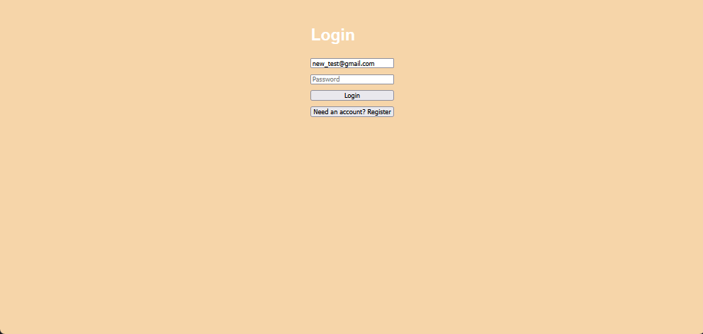

# SPEAR

A full-stack flashcards app with a React (Vite) frontend and a FastAPI backend. Users can register/login, create and manage decks and cards, and browse flashcards in a clean card-style UI. All data is stored in a database and scoped per user via JWT authentication.

### App Demonstration

### Authentication Demonstration



## Features
- Flip cards to see the answer (click on the flashcard).  
- Multiple decks available.  
- Navigate between cards with previous/next arrows.  
- Decks are selectable from a top deck bar.  
- Styled with vanilla CSS to match a card-style learning tool.

- User authentication (Register / Login / Logout) with JWT
- Deck CRUD: create, list, update, delete decks
- Card CRUD: create, list, update, delete cards per deck
- Per-user data isolation (each user only sees their own decks/cards)
- Flashcard UI:
  - Click-to-flip front/back
  - Previous/next navigation
  - Deck selection bar with horizontal scroll

- API docs available via Swagger UI


---

## Commands to try the app:

Clone repo
```bash
git clone https://github.com/IALT1234/SPEAR.git
cd SPEAR
npm install
```

Run the backend (FastAPI)
```bash
cd backend
python -m venv venv
# Windows:
venv\Scripts\activate
# macOS/Linux:
# source venv/bin/activate

pip install -r requirements.txt
uvicorn main:app --reload --port 8000
```

- Backend now running at:

  - http://127.0.0.1:80
  
Run the frontend (React)

```bash
cd SPEAR
npm install
npm run dev
```

- Frontend runs at:

  - http://localhost:5173


## API Notes

Authentication:

- POST /auth/register → create a user

- POST /auth/login → returns a JWT token


Protected routes require:

- Authorization: Bearer <token>


Available scripts (see `package.json`):

- `npm run dev` — start Vite dev server
- `npm run build` — build production bundle
- `npm run preview` — preview the production build locally
- `npm run lint` — run ESLint across the project


## Project structure

Top-level files:

- `index.html` — Vite entry HTML
- `package.json` — project metadata and scripts
- `vite.config.js` — Vite configuration

Main source tree (`src/`):

- `src/main.jsx` — app bootstrap and router 
- `src/App.jsx` — application root
- `src/index.css`, `src/App.css` — global styles

Components:

- `src/components/FlashCard.jsx` — single flashcard (front/back flip)
- `src/components/Deck.jsx` — deck wrapper / deck selector UI

Pages:

- `src/pages/Decks_Page.jsx` — deck selection bar / landing
- `src/pages/Current_Deck.jsx` — shows cards for the selected deck with navigation

CSS modules:

- `src/css/FlashCard.css`, `src/css/Decks_Page.css`, `src/css/Current_Deck.css`

Assets live in `src/assets/`.


Frontend (SPEAR/)

- src/App.jsx — app root, auth gating, main UI

- src/pages/ — decks page, current deck, auth pages

- src/components/ — FlashCard, Deck, Account (logout)

- src/api.js — API calls + auth header logic

- src/css/ — styling

Backend (backend/)

- main.py — FastAPI app + router registration

- models.py — SQLAlchemy models (User, Deck, Card)

- schemas.py — request/response validation

- database.py — SQLAlchemy engine/session

- routers/ — endpoints (auth, decks, cards)

- auth.py — password hashing + JWT creation/verification


## Roadmap

Short term

- Connect the UI 100% to backend IDs (remove any remaining sentinel UI modes)

- Add better error + loading states in the UI

- Improve delete confirmations and empty states

Medium term

- Add user profile (show email)

- Add progress tracking (cards studied, streaks)

- Add search + tags per deck

Long term

- Spaced repetition mode

- Deploy (Render/Fly.io for backend, Vercel/Netlify for frontend)

- Add tests (Pytest for API, Playwright/Cypress for UI)


## Notes

- If API calls return 401 Unauthorized, login again and confirm the token exists in localStorage.

- Swagger UI is the easiest way to test endpoints: http://127.0.0.1:8000/docs

---

